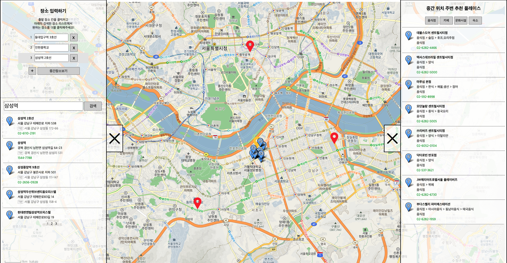

# Middle Location Search
- 진행시기 : 2021.8.6 - 2021.12.15
- 기술스택 : Java, Javascript, CSS, HTML, Apache Tomcat, Ajax, jQuery
- 프로젝트 링크 : https://github.com/Yeonji-Lim/Middle-Location-Search
- 서비스 링크 : http://52.79.59.95:8080/MLS/

## 동기
약속 장소를 정할 때는 꼭 모든 사람들의 중간 장소로만 정해야 하는 사람들을 위한 서비스 입니다.
중간 장소가 어디인지 고르고, 그 위치 주변에 약속장소를 찾는 것이 쉽지 않기 때문에 이를 대신하여 약속 장소 결정을 도와주는 서비스입니다. 

## 프로젝트 주제
출발지들을 입력하면 중간이 되는 장소를 반환합니다.
해당 위치 주변의 약속 장소를 추천합니다. 
추천 시 카테고리 별로 구분하여, 약속에 맞는 장소를 선택할 수 있도록 하였습니다. 

위 화면이 서비스 동작화면 입니다. 
왼쪽 사이드바에서 장소 검색 및 입력할 수 있고, 중간 장소 보기를 입력하면 
중간 장소가 노란 표시로 표시되며, 약속 추천 장소는 오른쪽 사이드바에서 리스트로도 볼 수 있고, 지도에 파란 표시로도 볼 수 있습니다.

## 개발
Java, Javascript를 사용하였습니다.
서버는 Apache Tomcat을 활용하였습니다.
어떤 프레임워크도 사용하지 않고 개발하였으며, jquery를 사용하여 SPA(Single Page Application)로 구현하였습니다.
AWS EC2를 사용하여 배포하였습니다.

## 소통 방법
정기적으로, 그리고 수시로 디스코드를 활용해서 개발 진행 상황을 공유하거나 회의를 진행했습니다.

## 역할
백엔드 개발을 담당하였습니다.
이에 따라 중간 장소를 찾는 알고리즘을 결정 및 구현하고, WAR 파일을 추출한 뒤 AWS EC2를 사용하여 배포하였습니다.

## 어려웠던 점
가운데 장소를 찾는 알고리즘의 결정과 구현에 많은 시간이 들었습니다.
처음에는 입력한 장소의 좌표들에 원적합을 적용하여, 그 장소들을 유사하게 지나는 원을 구하고, 그 원의 중심을 중간 장소로 반환했습니다.

이 과정에서 원적합이 구현된 오픈소스는 파이썬의 numpy를 사용한 코드만 있었기 때문에, java 기반의 tomcat에서 이를 사용하기 위해서 jython이나 java에서 python 프로그램 실행하기 와 같은 방법을 실행해보았는데, 결과적으로 두 방법 모두 numpy 라이브러리를 인식하지 못하기 때문에 실패하였습니다. 

그래서 직접 수학적인 원 적합 과정을 이해하고 그 과정을 행렬 연산을 지원하는 Java의 [Jama 라이브러리](https://math.nist.gov/javanumerics/jama/)를 활용해서 구현하였습니다.

그런데 그렇게 하였더니 점이 3개 이상이고 거의 직선에 가깝에 설정된 경우, 원이 거대하게 생성되어 터무니 없는 곳을 중간 장소로 도출하게 되는 이슈가 발생했습니다.

## 극복한 방법
이를 위해 알고리즘을 고민한 결과, 좌표들을 포함하는 가장 작은 원을 구현하여 그 원의 중심을 반환한다면, 위와 같은 이슈를 해결할 것으로 예상하였습니다. 
즉, [Smallest-circle problem을 해결하는 알고리즘](https://www.nayuki.io/page/smallest-enclosing-circle)을 활용하였습니다.

그 결과, 좌표상 정확한 중간 위치는 아니지만, 약속을 잡기에 합리적인 중간 장소를 알려주게 되었습니다.

## 배운 점
요구사항 분석, 자료조사, 기획 및 설계에 대한 중요성을 실감하였습니다.
중간 장소를 찾기 위한 알고리즘을 결정하고 이를 구현하기 위해서 많은 시간이 소모되었는데, 결과적으로 이슈가 발생하였습니다. 이를 해결하기 위한 새로운 알고리즘을 적용할 때는 오픈 소스를 활용하여 단시간 안에 구현하였습니다. 그런데 처음부터 실제 사용자가 원하는 실질적인 중간장소가 무엇인지 파악하고, 이를 구현할 수 있는 여러가지 알고리즘을 조사 및 비교한 뒤, 혹시 모를 수정에 대비하여 설계하였다면 조금 더 효율적으로 서비스를 구현해낼 수 있었을 것이라고 생각합니다.